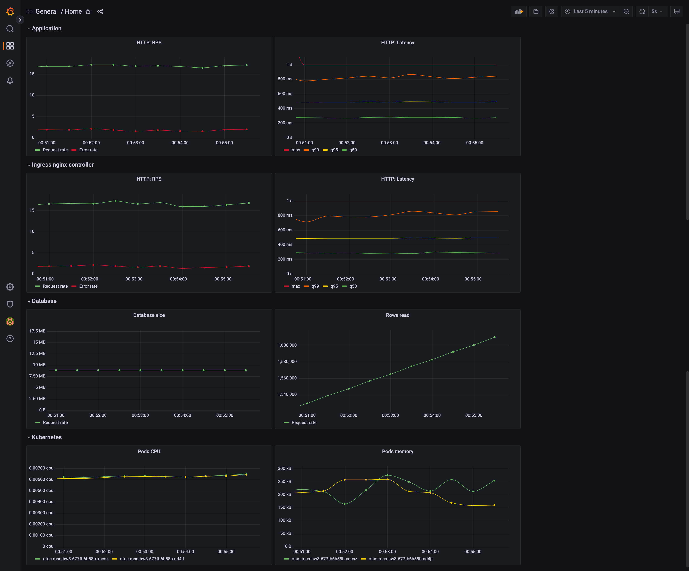

# Курс OTUS Microservice architect
## ДЗ №3 - «Prometheus. Grafana»

### TL;DR
1. `make k8s-pre-reqs`
2. `make k8s-deploy`
2. `make loadtest`
3. `make k8s-remove` 

### Подробнее 

```
Инструментировать сервис из прошлого задания метриками в формате Prometheus с помощью библиотеки для вашего фреймворка и ЯП.
Сделать дашборд в Графане, в котором были бы метрики с разбивкой по API методам:
1. Latency (response time) с квантилями по 0.5, 0.95, 0.99, max
2. RPS
3. Error Rate - количество 500ых ответов
```
В приложение добавлена миддлвара, которая
 - с шансом 10% возвращает 500 вместо 200
 - добавляет задержку от 0 до 500 мс с нелинейным шансом

```
Добавить в дашборд графики с метрикам в целом по сервису, взятые с nginx-ingress-controller:
1. Latency (response time) с квантилями по 0.5, 0.95, 0.99, max
2. RPS
3. Error Rate - количество 500ых ответов

На выходе должно быть:
1. скриншоты дашборды с графиками в момент стресс-тестирования сервиса. Например, после 5-10 минут нагрузки.
```

```
2. json-дашборды.
```
[json](grafana/dashboard.json)
```
3. добавить на дашборд графики с метриками:
  - Потребление подами приложения памяти
  - Потребление подами приолжения CPU
```
См. скриншот, раздел "Kubernetes"
```
4. добавить в общий дашборд графики с метриками работы БД.
```
См. скриншот, раздел "Database"
